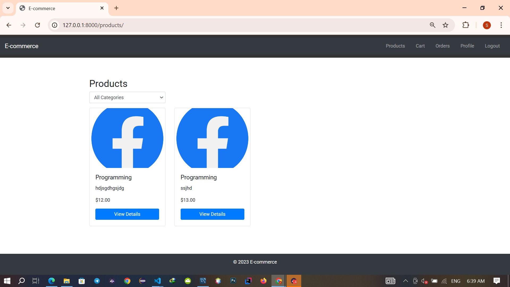
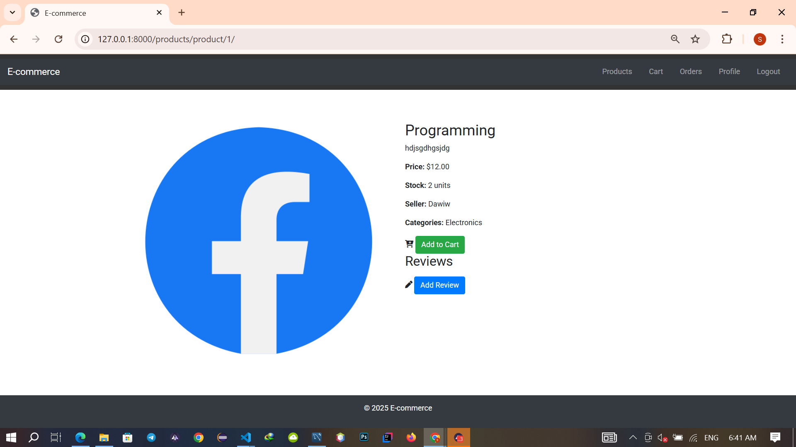
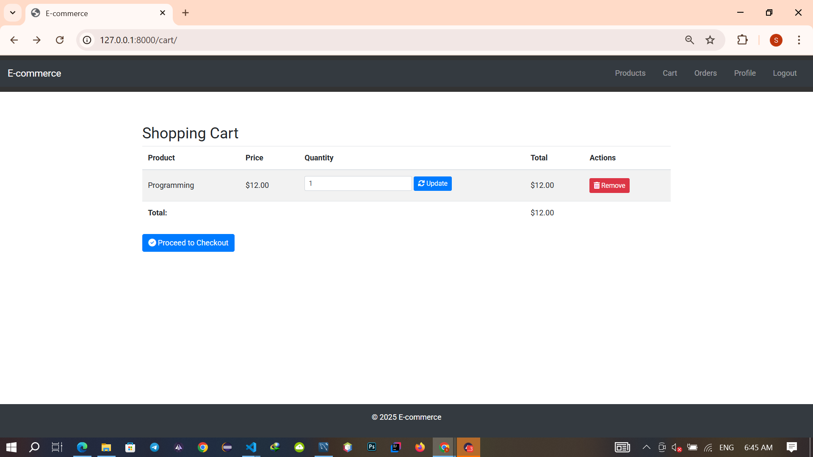
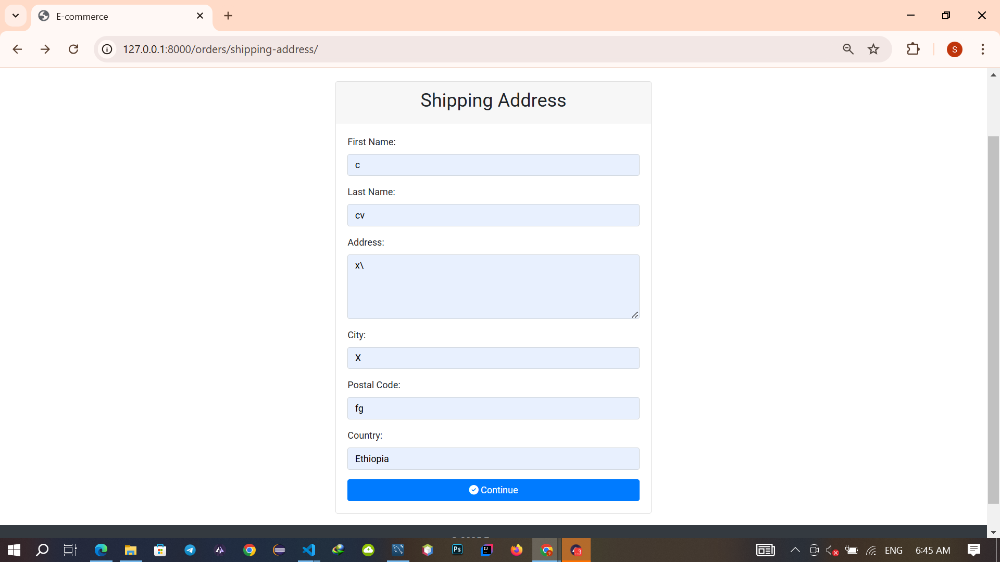
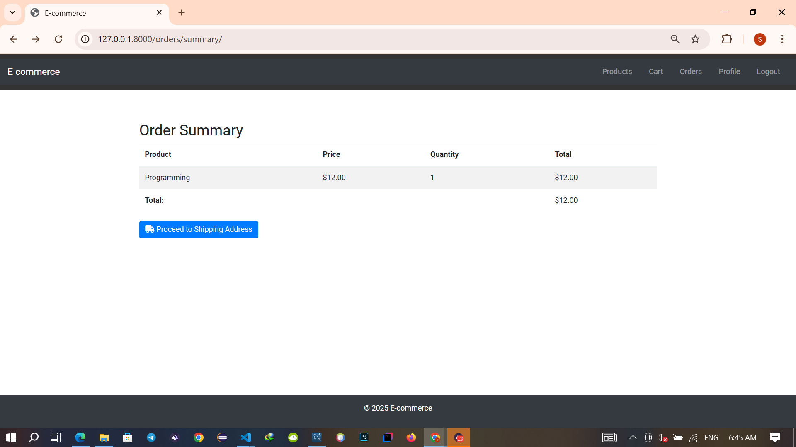
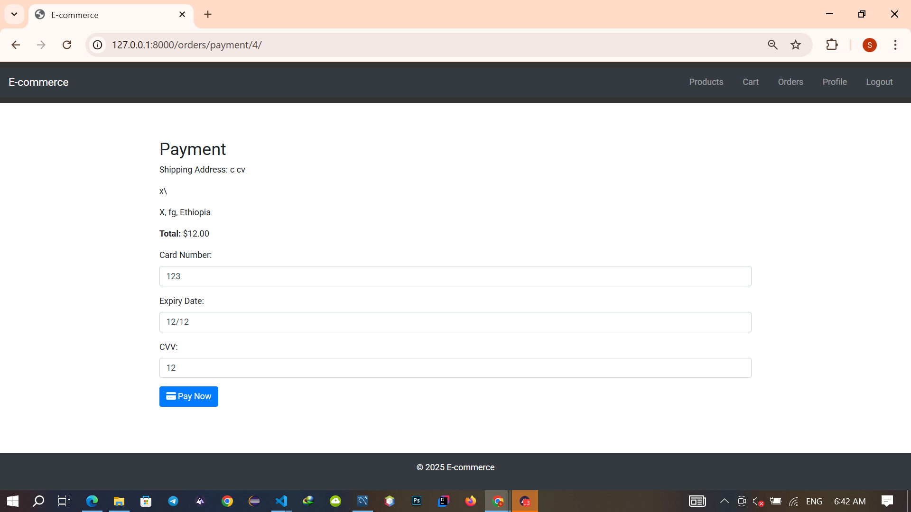

# E-commerce Project


## Overview

Welcome to the E-commerce Project! This is a fully functional e-commerce platform built using Django, a high-level Python web framework. The project allows users to register, log in, browse products, add products to their cart, proceed to checkout, and manage their orders. Admins can manage products, stock, categories, and reviews.

## Features

- **User Authentication & Authorization**
  - Registration: Users can create accounts using an email/password.
  - Login/Logout: Secure login/logout system with sessions.
  - Password Recovery: Ability for users to reset their passwords.

- **Product Catalog**
  - Product Listing: Display products in various categories with search and filter options.
  - Product Details: Include detailed descriptions, images, prices, availability, and product reviews.
  - Product Sorting: Sorting options (e.g., by price, rating, latest) for better browsing.

- **Shopping Cart**
  - Add to Cart: Users can add multiple products to the cart.
  - View Cart: Users can view the cart, edit quantities, and remove products.
  - Cart Persistence: Store cart information even if the user logs out.

- **Checkout System**
  - Order Summary: Display a summary of items in the cart, including price, quantity, and total.
  - Shipping Address: Collect user’s shipping address.
  - Payment Gateway Integration: Secure payment system (e.g., Stripe, PayPal, or credit card processing).
  - Order Confirmation: Send a confirmation email and show order status.

- **Order Management**
  - Order History: Users can view past orders and order details.
  - Track Orders: Users can track the status of their current orders (processing, shipped, delivered).
  - Admin Panel: Admin can view and manage orders, update statuses, and manage shipping.

- **Product Management (Admin)**
  - Product Management: Admin can add, edit, and delete products.
  - Stock Management: Track product stock levels and set stock limits.
  - Categories & Tags: Organize products into categories for easy navigation.

- **Reviews & Ratings**
  - Product Reviews: Allow users to rate products and leave reviews.
  - Admin Approval: Admin can moderate or approve reviews.

- **Discounts & Coupons**
  - Discount Codes: Admin can create and manage discount codes for specific products or categories.
  - Automatic Discounts: Discounts can be applied based on cart value or special promotions.

## Non-Functional Requirements

- **Performance**
  - Page Speed: Ensure the website loads quickly to enhance user experience.
  - Scalability: The system should handle a large number of users, products, and transactions without performance degradation.

- **Security**
  - SSL Encryption: Use SSL certificates to encrypt user data during transactions.
  - Data Protection: Ensure sensitive information like passwords and payment details are securely stored and transmitted.
  - User Authentication: Implement secure password storage using techniques like hashing.

- **Usability**
  - Responsive Design: Ensure the website works seamlessly on desktop, tablet, and mobile devices.
  - User-Friendly Interface: The UI should be intuitive and easy to navigate for both users and admins.
  - Search Functionality: Users should be able to easily search for products by name, category, or tags.

- **SEO & Marketing**
  - SEO Optimization: Optimize product pages and content for search engines.
  - Analytics: Integrate with Google Analytics or similar tools to track user behavior and sales performance.

- **Backup & Recovery**
  - Data Backup: Regular backups of user, product, and order data.
  - Disaster Recovery: Ability to recover from unexpected failures and minimize downtime.

- **Compliance**
  - Privacy Policy: Comply with data protection regulations (e.g., GDPR) by providing a privacy policy.
  - Terms & Conditions: Include terms and conditions for using the website, particularly for transactions.

## Technical Requirements

- **Framework & Tools**
  - Backend: Django (Python) for server-side logic and database management.
  - Frontend: HTML, CSS, JavaScript (Bootstrap for responsive design).
  - Database: Mysql for storing user, product, and order data.
  - Payment Integration: Stripe, PayPal, or another payment gateway.

- **Hosting & Deployment**
  - Cloud Hosting: Use platforms like AWS, DigitalOcean, or Heroku for hosting.
  - Version Control: Git for managing code versioning (GitHub or GitLab for repository).
  - Continuous Integration/Continuous Deployment (CI/CD): Automate testing and deployment using tools like Jenkins or GitHub Actions.

## Getting Started

### Prerequisites

- Python 3.12+
- Mysql
- pip

### Installation

1. **Clone the Repository**

    ```bash
    git clone https://github.com/Dawaman43/Ecommerce-platform.git
    cd ecommerce_project
    ```

2. **Create a Virtual Environment**

    ```bash
    python -m venv ecommerce-env
    source ecommerce-env/bin/activate  # On Windows use `ecommerce-env\Scripts\activate`
    ```

3. **Install Dependencies**

    ```bash
    pip install -r requirements.txt
    ```

4. **Configure Database**

    - Ensure PostgreSQL is installed and running.
    - Create a database named `ecommerce_db` and update `ecommerce_project/settings.py` with your database credentials.

    ```python
    DATABASES = {
        'default': {
            'ENGINE': 'django.db.backends.mysql',
            'NAME': 'ecommerce_db',
            'USER': 'your_db_user',
            'PASSWORD': 'your_db_password',
            'HOST': 'localhost',
            'PORT': '5432',
        }
    }
    ```

5. **Apply Migrations**

    ```bash
    python manage.py makemigrations
    python manage.py migrate
    ```

6. **Create a Superuser**

    ```bash
    python manage.py createsuperuser
    ```

7. **Run the Server**

    ```bash
    python manage.py runserver
    ```

    Visit `http://127.0.0.1:8000/` in your browser to see the e-commerce website in action.

## Usage

### User Authentication & Authorization

- **Register**: Create an account using an email and password.
- **Login**: Log in to access your account.
- **Logout**: Securely log out of your account.
- **Profile**: View and edit your profile information.

### Product Catalog

- **Browse Products**: View products in different categories.
- **Search Products**: Search for products by name, category, or tags.
- **Product Details**: View detailed information about a product, including images, prices, availability, and reviews.
- **Add to Cart**: Add products to your shopping cart.

### Shopping Cart

- **View Cart**: View the products in your cart, edit quantities, and remove products.
- **Proceed to Checkout**: Move to the checkout process.

### Checkout System

- **Order Summary**: Review items in your cart, including prices, quantities, and totals.
- **Shipping Address**: Enter your shipping address.
- **Payment**: Complete the payment process using a secure payment gateway.
- **Order Confirmation**: Receive a confirmation email and view your order status.

### Order Management

- **Order History**: View past orders and order details.
- **Track Orders**: Track the status of your current orders.

### Product Management (Admin)

- **Add Products**: Admin can add new products.
- **Edit Products**: Admin can edit existing products.
- **Delete Products**: Admin can delete products.
- **Stock Management**: Track and manage product stock levels.
- **Categories & Tags**: Organize products into categories and tags.

### Reviews & Ratings

- **Add Reviews**: Users can rate products and leave reviews.
- **Admin Approval**: Admin can moderate or approve reviews.

### Discounts & Coupons

- **Discount Codes**: Admin can create and manage discount codes.
- **Automatic Discounts**: Discounts can be applied based on cart value or special promotions.

## Screenshots








## Contributing

Contributions are welcome! Please follow these guidelines:

1. Fork the repository.
2. Create a new branch for your feature or bug fix.
3. Commit your changes.
4. Push to your branch.
5. Open a pull request.

## License

This project is licensed under the MIT License - see the [LICENSE](LICENSE) file for details.

## Contact

- **Author**: Dawit Worku
- **Email**: dawitworkujima@gmail.com
- **GitHub**: [Dawaman43](https://github.com/Dawaman43)

---

**Happy Shopping! 🛍️**